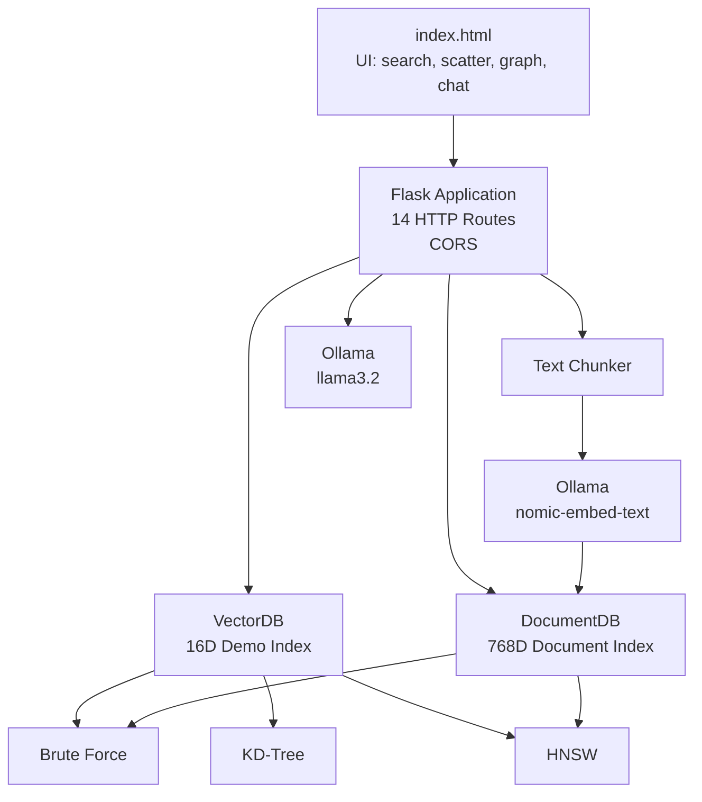

# Tessera

A small, in-memory vector database and retrieval-augmented generation (RAG) engine with a browser UI. Tessera bundles three exact/approximate search algorithms, three distance metrics, document chunking, and a local-LLM-backed Q&A pipeline, served as a single Python process over HTTP.

---

## What it does

| Capability | Notes |
|---|---|
| Three search algorithms | Brute Force (exact), KD-Tree (exact, axis-aligned), HNSW (hand-ported, approximate) |
| Three distance metrics | Cosine similarity, Euclidean, Manhattan |
| 16-dimensional demo vectors | 20 pre-seeded vectors across four categories (CS, Math, Food, Sports) for the UI and benchmark |
| Document embeddings | Real 768-dimensional embeddings via Ollama's `nomic-embed-text` |
| Document chunking | Long texts are split into ~250-word overlapping chunks before embedding |
| RAG pipeline | Embed a question, retrieve the top-k chunks, generate an answer with a local LLM |
| REST API | 14 HTTP routes, byte-exact JSON formatting, CORS preflight |
| Browser UI | A single-page `index.html` served from the root, with PCA scatter, query bar, HNSW visualization, and chat |

The frontend includes an interactive HNSW graph view powered by Tessera's deterministic HNSW index.

---

## Architecture



Tessera runs as a single Flask process. `VectorDB` provides a unified interface over Brute Force, KD-Tree, and HNSW indexing for the 16-dimensional demo dataset. `DocumentDB` manages embedded document chunks and uses brute-force search for small collections before switching to HNSW.

The browser frontend communicates exclusively through the HTTP API and provides interactive visualizations for vector search, benchmarks, HNSW topology, and retrieval-augmented generation.

---

## Core components

### VectorDB

The `VectorDB` layer manages the demo vector collection and exposes three search strategies:

- **Brute Force** — exact linear k-nearest-neighbor search
- **KD-Tree** — exact axis-aligned spatial indexing
- **HNSW** — approximate nearest-neighbor search using a layered graph

All algorithms share the same distance-function interface, allowing the search metric to be selected per request.

### DocumentDB

`DocumentDB` handles text-oriented retrieval.

The pipeline is:

```text
Document
   ↓
Text Chunking
   ↓
Ollama Embedding
   ↓
768D Vector
   ↓
DocumentDB
   ↓
Brute Force / HNSW Retrieval
```

For fewer than 10 stored chunks, the system uses brute-force search. Larger collections use HNSW.

### RAG pipeline

The RAG flow is:

```text
User Question
      ↓
Embedding via Ollama
      ↓
Vector Search
      ↓
Top-K Relevant Chunks
      ↓
Context Assembly
      ↓
Local LLM
      ↓
Generated Answer
```

Tessera uses:

- `nomic-embed-text` for embeddings
- `llama3.2` for response generation

---

## Modules

| File | Role |
|---|---|
| `py/vectordb/app.py` | Flask application, HTTP routes, CORS, request handling |
| `py/vectordb/db.py` | `VectorDB` wrapper around the three indices |
| `py/vectordb/document_db.py` | `DocumentDB`, document storage and retrieval |
| `py/vectordb/bruteforce.py` | Exact linear-scan k-NN |
| `py/vectordb/kdtree.py` | Exact axis-aligned KD-Tree |
| `py/vectordb/hnsw.py` | HNSW approximate-nearest-neighbor index |
| `py/vectordb/distances.py` | Cosine, Euclidean, Manhattan metrics |
| `py/vectordb/chunker.py` | Overlapping word-boundary text chunker |
| `py/vectordb/ollama.py` | HTTP client for Ollama embeddings and generation |
| `py/vectordb/demo_data.py` | Seed dataset containing 20 demo vectors |
| `py/vectordb/json_format.py` | JSON and numeric formatting helpers |
| `py/vectordb/__main__.py` | `python -m vectordb` entry point |
| `py/vectordb/__init__.py` | Package metadata and runtime configuration |

---

## Implementation details

### Demo vector index

The demo index uses:

- **20 vectors**
- **16 dimensions**
- Four categories:
  - Computer Science
  - Mathematics
  - Food
  - Sports

The demo dataset powers the browser visualizations, search interface, and benchmark view.

### HNSW

Tessera's HNSW implementation uses:

```text
M = 16
ef_construction = 200
ef = 50
```

The graph is deterministic for a consistent insertion sequence, allowing the frontend to visualize the resulting topology through `/hnsw-info`.

### Distance metrics

Three metrics are available:

#### Cosine

Measures angular similarity between vectors.

#### Euclidean

The standard L2 distance:

```text
sqrt(sum((a_i - b_i)^2))
```

#### Manhattan

The L1 distance:

```text
sum(abs(a_i - b_i))
```

### Document embeddings

Documents are converted into embeddings using:

```text
nomic-embed-text
```

The resulting vectors are typically **768-dimensional**.

Document dimensions are detected when the first embedding is inserted into `DocumentDB`.

### Text chunking

Incoming documents are split into overlapping chunks:

```text
chunk size: 250 words
overlap:    30 words
```

For multi-chunk documents, titles are suffixed with their chunk position.

### In-memory storage

Tessera currently uses in-memory storage.

Restarting the server:

- reloads the 20 demo vectors
- clears inserted demo vectors
- clears stored document chunks

There is currently no persistent database layer.

### Flask server

The application runs as a single Flask process with:

```python
threaded=False
```

This keeps the execution model simple and predictable.

### JSON formatting

Tessera uses dedicated formatting helpers to keep numeric serialization stable across API responses.

This is particularly important for the browser frontend, which expects consistent response shapes and numeric formatting.

### CORS

CORS preflight requests are handled explicitly.

The application responds to `OPTIONS` requests with:

```text
HTTP 204
```

and the required `Access-Control-Allow-*` headers.

---

## Installation

### Prerequisites

- **Python 3.11 or newer**
- **pip**
- **Ollama** for document embedding and RAG functionality

Ollama is optional for vector-search functionality but required for:

- `/doc/insert`
- `/doc/search`
- `/doc/ask`

Download Ollama from:

<https://ollama.com>

---

## Setup — Windows / PowerShell

### 1. Clone the repository

```powershell
git clone <repository-url> tessera
cd tessera
```

### 2. Create a virtual environment

```powershell
python -m venv .venv
```

Activate it:

```powershell
.\.venv\Scripts\activate
```

### 3. Install dependencies

```powershell
pip install -r requirements.txt
```

### 4. Install Ollama models

```powershell
ollama pull nomic-embed-text
ollama pull llama3.2
```

### 5. Start Tessera

From the repository root:

```powershell
python main.py
```

---

## Setup — Unix / macOS / Linux

```bash
git clone <repository-url> tessera
cd tessera

python3.11 -m venv .venv
source .venv/bin/activate

pip install -r requirements.txt
```

Install the Ollama models:

```bash
ollama pull nomic-embed-text
ollama pull llama3.2
```

Start the server:

```bash
python main.py
```

---

## Alternative entry points

Tessera provides multiple ways to start the server.

### Root entry point

```bash
python main.py
```

### Package entry point

From the `py` directory:

```bash
python -m vectordb
```

### Console script

After installing the package:

```bash
pip install .
```

you can run:

```bash
vectordb-server
```

---

## Running the application

Once the server starts, open:

<http://localhost:8080>

You will see the Tessera browser interface with:

- vector search
- algorithm selection
- distance metric selection
- top-k control
- PCA visualization
- HNSW graph visualization
- benchmark information
- document management
- retrieval-augmented generation

Typical startup output:

```text
=== Tessera Engine ===
http://localhost:8080
16 dims | HNSW+KD-Tree+BruteForce
Ollama: ONLINE
  embed model: nomic-embed-text  gen model: llama3.2
```

---

## Running the tests

From the repository root:

```bash
cd py
pytest
```

The project currently contains:

```text
93 tests
12 test modules
```

The test suite covers:

- API behavior
- vector database operations
- Brute Force search
- KD-Tree search
- HNSW search
- distance metrics
- demo data
- document chunking
- document retrieval
- JSON formatting
- Ollama client behavior

The tests do not require a running Ollama instance because Ollama-dependent functionality is tested through mocked clients.

---

# HTTP API

All API endpoints are served from:

```text
http://localhost:8080
```

Validation failures return an HTTP `200` response containing an error body of the form:

```json
{
  "ok": false,
  "err": "..."
}
```

CORS preflight requests return:

```text
HTTP 204
```

---

## Demo vector endpoints

### `GET /`

Returns the Tessera browser interface.

**Response**

```text
Content-Type: text/html
```

---

### `GET /search`

Performs k-nearest-neighbor search over the 16-dimensional demo index.

#### Query parameters

| Parameter | Type | Default | Description |
|---|---|---|---|
| `v` | string | required | Comma-separated 16-dimensional vector |
| `k` | integer | `5` | Number of results |
| `metric` | string | `cosine` | `cosine`, `euclidean`, `manhattan` |
| `algo` | string | `hnsw` | `bruteforce`, `kdtree`, `hnsw` |

#### Example

```text
GET /search?v=0.9,0.85,...&k=5&metric=cosine&algo=hnsw
```

#### Response

```json
{
  "results": [
    {
      "id": 1,
      "metadata": "...",
      "category": "cs",
      "distance": "0.000000",
      "embedding": [0.9, 0.85, "..."]
    }
  ],
  "latencyUs": 142,
  "algo": "hnsw",
  "metric": "cosine"
}
```

---

### `POST /insert`

Insert a new demo vector.

#### Request body

```json
{
  "metadata": "Example vector",
  "category": "cs",
  "emb": [0.1, 0.2, "..."]
}
```

The embedding must contain exactly 16 values.

#### Response

```json
{
  "id": 21
}
```

---

### `DELETE /delete/<id>`

Delete a demo vector.

Example:

```text
DELETE /delete/5
```

#### Response

```json
{
  "ok": true
}
```

---

### `GET /items`

Returns all stored demo vectors.

#### Response

```json
[
  {
    "id": 1,
    "metadata": "...",
    "category": "cs",
    "embedding": [0.9, 0.85, "..."]
  }
]
```

---

### `GET /benchmark`

Runs the same query through all three search algorithms and returns latency information.

#### Query parameters

| Parameter | Type | Default |
|---|---|---|
| `v` | string | required |
| `k` | integer | `5` |
| `metric` | string | `cosine` |

#### Response

```json
{
  "bruteforceUs": 120,
  "kdtreeUs": 105,
  "hnswUs": 142,
  "itemCount": 20
}
```

---

### `GET /hnsw-info`

Returns HNSW graph information used by the interactive visualization.

The response includes:

- top layer
- node count
- nodes per layer
- edges per layer
- graph nodes
- graph edges

Node structure:

```json
{
  "id": 1,
  "metadata": "...",
  "category": "cs",
  "maxLyr": 2
}
```

Edge structure:

```json
{
  "src": 1,
  "dst": 5,
  "lyr": 0
}
```

---

### `GET /stats`

Returns a summary of the demo index.

#### Response

```json
{
  "count": 20,
  "dims": 16,
  "algorithms": [
    "bruteforce",
    "kdtree",
    "hnsw"
  ],
  "metrics": [
    "cosine",
    "euclidean",
    "manhattan"
  ]
}
```

---

## Document and RAG endpoints

### `POST /doc/insert`

Adds a document to the retrieval system.

The document is chunked, embedded, and stored.

#### Request body

```json
{
  "title": "Example Document",
  "text": "Document content goes here..."
}
```

#### Processing pipeline

```text
Document
   ↓
250-word chunking
   ↓
30-word overlap
   ↓
Ollama embedding
   ↓
768D vector
   ↓
DocumentDB
```

#### Response

```json
{
  "ids": [1, 2, 3],
  "chunks": 3,
  "dims": 768
}
```

---

### `DELETE /doc/delete/<id>`

Deletes a document chunk.

Example:

```text
DELETE /doc/delete/4
```

#### Response

```json
{
  "ok": true
}
```

---

### `GET /doc/list`

Returns all stored document chunks.

#### Response

```json
[
  {
    "id": 1,
    "title": "Example Document",
    "preview": "Document preview...",
    "words": 250
  }
]
```

---

### `POST /doc/search`

Embeds a question and retrieves the most relevant document chunks.

#### Request body

```json
{
  "question": "What is vector search?",
  "k": 3
}
```

#### Response

```json
{
  "contexts": [
    {
      "id": 1,
      "title": "Example Document",
      "distance": "0.1234"
    }
  ]
}
```

---

### `POST /doc/ask`

Runs the complete RAG pipeline.

#### Request body

```json
{
  "question": "What is vector search?",
  "k": 3
}
```

#### Processing

```text
Question
   ↓
Embedding
   ↓
Top-K retrieval
   ↓
Context assembly
   ↓
Local LLM generation
   ↓
Answer
```

### Response

The response contains:

- generated answer
- generation model
- retrieved contexts
- context text
- retrieval distance
- document count

---

### `GET /status`

Returns server health and index information.

#### Response

```json
{
  "ollamaAvailable": true,
  "embedModel": "nomic-embed-text",
  "genModel": "llama3.2",
  "docCount": 0,
  "docDims": 0,
  "demoDims": 16,
  "demoCount": 20
}
```

---

# Project structure

```text
.
├── index.html
├── main.py
├── requirements.txt
│
└── py/
    ├── pyproject.toml
    │
    ├── vectordb/
    │   ├── __init__.py
    │   ├── __main__.py
    │   ├── app.py
    │   ├── db.py
    │   ├── document_db.py
    │   ├── bruteforce.py
    │   ├── kdtree.py
    │   ├── hnsw.py
    │   ├── distances.py
    │   ├── chunker.py
    │   ├── ollama.py
    │   ├── demo_data.py
    │   └── json_format.py
    │
    └── tests/
        ├── conftest.py
        ├── test_api.py
        ├── test_bruteforce.py
        ├── test_chunker.py
        ├── test_db.py
        ├── test_demo_data.py
        ├── test_distances.py
        ├── test_document_db.py
        ├── test_hnsw.py
        ├── test_json_format.py
        ├── test_kdtree.py
        └── test_ollama.py
```

---

# Design characteristics

### Exact and approximate retrieval

Tessera exposes both exact and approximate approaches:

```text
Exact
├── Brute Force
└── KD-Tree

Approximate
└── HNSW
```

This makes it possible to compare algorithmic trade-offs directly through both the API and browser interface.

### Small-N optimization

`DocumentDB` automatically chooses its retrieval strategy based on collection size:

```text
< 10 chunks
    ↓
Brute Force

≥ 10 chunks
    ↓
HNSW
```

This avoids unnecessary approximate-index overhead for very small collections.

### Local AI integration

All document embedding and generation is performed through a locally hosted Ollama instance.

No hosted LLM API is required for the RAG pipeline.

---

# Current limitations

- **In-memory only.** Data is lost when the server restarts.
- **Single-threaded server.** The Flask server currently runs with `threaded=False`.
- **16-dimensional demo index.** The demo `VectorDB` is fixed to 16 dimensions.
- **Ollama dependency.** Document embeddings and RAG require Ollama.
- **Fixed models.** The application currently uses `nomic-embed-text` and `llama3.2`.
- **Approximate HNSW retrieval.** HNSW trades exactness for efficient approximate nearest-neighbor search.
- **No persistent document store.** Documents and embeddings currently exist only in memory.
- **No authentication layer.** The HTTP API is currently intended for local use.

---

# Performance and benchmarking

The `/benchmark` endpoint allows direct comparison between:

```text
Brute Force
KD-Tree
HNSW
```

using the same query and distance metric.

The browser UI exposes these results visually so the behavior of the different indexing strategies can be explored interactively.

---

# Future improvements

Possible future directions include:

- persistent storage
- configurable vector dimensions
- pluggable embedding providers
- configurable LLM providers
- asynchronous document processing
- production-grade WSGI deployment
- configurable HNSW parameters
- additional vector indexes
- batch insertion APIs
- authentication and authorization
- richer observability and metrics

---

# License

See the repository license for licensing information.
