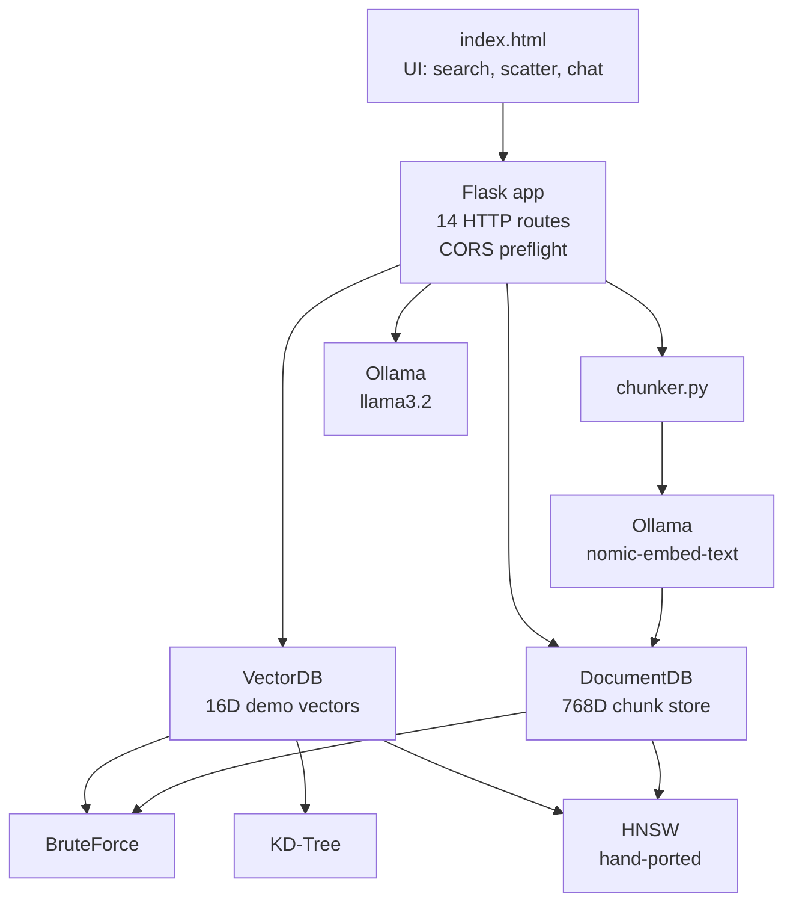

# Tessera

A small, in-memory vector database and retrieval-augmented generation (RAG) engine with a browser UI. Tessera bundles three ANN/exact search algorithms, three distance metrics, document chunking, and a local-LLM-backed Q&A pipeline, served as a single Python process over HTTP.

The implementation is a line-faithful Python port of a former C++/cpp-httplib backend. The C++ source and the vendored HTTP dependency have been removed; only the Python service remains.

---

## What it does

| Capability | Notes |
|---|---|
| Three search algorithms | Brute Force (exact), KD-Tree (exact, axis-aligned), HNSW (hand-ported, approximate) |
| Three distance metrics | Cosine similarity, Euclidean, Manhattan |
| 16-dimensional demo vectors | 20 pre-seeded vectors across four categories (CS, Math, Food, Sports) for the UI and benchmark |
| Document embeddings | Real 768-dimensional embeddings via Ollama's `nomic-embed-text` |
| Document chunking | Long texts are split into ~250-word overlapping chunks before embedding |
| RAG pipeline | Embed a question, retrieve the top-k chunks, generate an answer with a local LLM |
| REST API | 14 HTTP routes, byte-exact JSON formatting, CORS preflight |
| Browser UI | A single-page `index.html` served from the root, with PCA scatter, query bar, and chat |

The frontend renders an HNSW graph view; the graph shape is produced by a hand-ported HNSW implementation, not a third-party library, to keep the topology deterministic and comparable to the original C++ build.

---

## Architecture



The service is a single Flask process. `VectorDB` holds the 16-dimensional demo vectors and exposes all three algorithms behind a unified search interface. `DocumentDB` stores embedded text chunks and falls back to brute force for fewer than 10 items, otherwise using HNSW with a brute-force mirror to keep the small-N path exact. The chunker splits incoming text on word boundaries; Ollama is the only external service the server talks to, and every Ollama call is best-effort — if the server is unreachable the route returns an `err(...)` JSON body with HTTP 200, matching the original C++ behavior.

### Modules

| File | Role |
|---|---|
| `py/vectordb/app.py` | Flask app; the 14 routes and CORS handling live here |
| `py/vectordb/db.py` | `VectorDB` wrapper around the three indices |
| `py/vectordb/document_db.py` | `DocumentDB`; chunk store with hybrid brute-force / HNSW search |
| `py/vectordb/bruteforce.py` | Linear-scan k-NN; the ground-truth path |
| `py/vectordb/kdtree.py` | Axis-aligned k-d tree |
| `py/vectordb/hnsw.py` | Hand-ported HNSW, deterministic graph shape |
| `py/vectordb/distances.py` | Cosine, Euclidean, Manhattan |
| `py/vectordb/chunker.py` | Overlapping word-boundary chunker |
| `py/vectordb/ollama.py` | Thin HTTP client for `/api/embeddings` and `/api/generate` |
| `py/vectordb/demo_data.py` | The 20 seeded 16D vectors |
| `py/vectordb/json_format.py` | Hand-rolled float / string / vector formatters (byte-exact output) |
| `py/vectordb/__main__.py` | `python -m vectordb` entry point |
| `py/vectordb/__init__.py` | Package metadata (`DIMS=16`, `OLLAMA_HOST`, `OLLAMA_PORT`) |

---

## Implementation details

- **16-dimensional demo vectors.** All demo data and the in-memory demo index use 16 dimensions. The dimension is fixed in `py/vectordb/__init__.py` as `DIMS = 16`; the search and benchmark routes reject vectors of any other length.
- **HNSW configuration.** `M = 16`, `ef_construction = 200`, search `ef = 50`. The graph is built deterministically — the same insertion order produces the same `/hnsw-info` output — because the index is consumed by the UI's graph rendering.
- **Distance metrics.** Cosine similarity is clamped to be non-negative. Euclidean is the standard L2 norm. Manhattan is the L1 norm. Each metric is a plain Python function in `distances.py`; algorithms take a distance function as an argument.
- **Document embeddings.** `nomic-embed-text` produces 768-dimensional vectors. Dimensions are detected lazily on the first chunk inserted into `DocumentDB`.
- **Document chunking.** `chunk_text(text, 250, 30)` produces chunks of up to 250 words with a 30-word overlap. Single-chunk documents are stored under their original title; multi-chunk documents get a `Title [i/N]` suffix.
- **In-memory state.** Both indices live in process memory. Restarting the server reseeds the 20 demo vectors and clears all document chunks — there is no persistence layer.
- **Flask single-threaded.** The server is started with `app.run(threaded=False)`. This preserves the request-handling semantics of the original C++ service; it is not safe to share the `VectorDB` or `DocumentDB` instances across threads.
- **JSON formatting.** Responses are built by string concatenation through `f4`, `f6`, `f4q`, `f6q`, `j_s`, and `j_vec` in `json_format.py`. The byte-exact output is load-bearing: the frontend reads the JSON shape (including the quoted form of `f6q`-formatted floats) and assumes a stable layout. Standard `json.dumps` is intentionally not used.
- **CORS.** All responses carry `Access-Control-Allow-Origin`, `Access-Control-Allow-Methods`, and `Access-Control-Allow-Headers`. `OPTIONS` requests are intercepted in a `before_request` handler and answered with HTTP 204.
- **C++ removed.** The repository no longer contains the original C++ backend or the vendored `httplib.h` single-header HTTP library. The Python service is the only implementation.

---

## Installation

### Prerequisites

- **Python ≥ 3.11** (declared in `py/pyproject.toml`)
- **Ollama** (optional, but required for `/doc/*` and RAG routes). Install from <https://ollama.com>.

### Setup (Windows / PowerShell)

```powershell
# 1. Clone
git clone <repository-url> tessera
cd tessera

# 2. Create a virtual environment
python -m venv .venv
.\.venv\Scripts\activate

# 3. Install dependencies
pip install -r requirements.txt

# 4. (Optional) Install Ollama and pull the models
#    Download from https://ollama.com/download
ollama pull nomic-embed-text
ollama pull llama3.2

# 5. Start the server (from the repo root)
python main.py
#    or, equivalently:
#    python -m vectordb
```

### Setup (Unix / Conda)

```bash
git clone <repository-url> tessera
cd tessera

python3.11 -m venv .venv
source .venv/bin/activate
pip install -r requirements.txt

# Ollama is the same on every platform:
ollama pull nomic-embed-text
ollama pull llama3.2
```

### Entry points

- `python main.py` from the repo root — a thin shim that calls `py.vectordb.run_server()`.
- `python -m vectordb` — the package's own `__main__`. Identical behavior.
- `vectordb-server` — installed as a console script by `pip install .`; defined in `py/pyproject.toml`.

### Server output

```
=== VectorDB Engine ===
http://localhost:8080
16 dims | HNSW+KD-Tree+BruteForce
Ollama: ONLINE
  embed model: nomic-embed-text  gen model: llama3.2
```

Open <http://localhost:8080> in a browser to use the UI.

---

## Running the tests

```bash
# From the repo root, with the virtual environment active
cd py
pytest
```

The test suite contains 93 tests across 12 files. It covers the API layer, brute-force and KD-tree indices, the hand-ported HNSW, document chunking and retrieval, JSON formatting helpers, the Ollama client, the demo seed data, and the package's distance functions. The tests run without Ollama being available; Ollama-dependent paths are exercised against a mock client.

The tests do not assert runtime parity with the previous C++ implementation against parity-test fixtures. The migration preserves the wire format and the visible algorithm behavior, but a byte-level C++↔Python comparison is not currently part of the test suite.

---

## HTTP API reference

All routes return JSON. On a validation error the server returns HTTP 200 with a `{"ok":false,"err":"..."}` body; this matches the original C++ behavior, where the status line was always 200.

CORS preflight (`OPTIONS` to any route) is handled in a `before_request` hook and returns HTTP 204 with the three `Access-Control-Allow-*` headers.

### Demo vectors

#### `GET /`
Returns the contents of `index.html` from the repo root (or `./index.html` if not found one level up). `Content-Type: text/html`.

#### `GET /search`
k-NN search over the 16-dimensional demo index.

| Query param | Type | Default | Notes |
|---|---|---|---|
| `v` | string | required | Comma-separated 16 floats |
| `k` | int | `5` | Number of neighbors |
| `metric` | string | `cosine` | `cosine`, `euclidean`, `manhattan` |
| `algo` | string | `hnsw` | `bruteforce`, `kdtree`, `hnsw` |

Response shape:
```json
{
  "results": [
    {"id": 7, "metadata": "...", "category": "...", "distance": 0.012345, "embedding": [0.1, 0.2, ...]}
  ],
  "latencyUs": 142,
  "algo": "hnsw",
  "metric": "cosine"
}
```

#### `POST /insert`
Insert one 16-dimensional demo vector. JSON body: `{"metadata": "...", "category": "...", "emb": [16 floats]}`. Response: `{"id": <int>}`.

#### `DELETE /delete/<id>`
Delete the demo vector with the given numeric id. Response: `{"ok": true}` or `{"ok": false}`.

#### `GET /items`
List every demo vector. Response: a JSON array of `{id, metadata, category, embedding}` objects.

#### `GET /benchmark`
Run all three algorithms against the same query and return per-algorithm latencies in microseconds.

| Query param | Type | Default |
|---|---|---|
| `v` | string | required, 16 floats |
| `k` | int | `5` |
| `metric` | string | `cosine` |

Response: `{"bruteforceUs": int, "kdtreeUs": int, "hnswUs": int, "itemCount": int}`.

#### `GET /hnsw-info`
Inspect the HNSW graph topology. Used by the UI to draw the graph.

Response: top layer, node count, per-layer node and edge counts, plus a flat list of nodes (`{id, metadata, category, maxLyr}`) and edges (`{src, dst, lyr}`).

#### `GET /stats`
Static index summary: `{"count": int, "dims": 16, "algorithms": [...], "metrics": [...]}`.

### Documents and RAG

#### `POST /doc/insert`
Chunk, embed, and store a document. JSON body: `{"title": "...", "text": "..."}`. Each chunk is embedded with `nomic-embed-text` (768D) and inserted into the `DocumentDB` index. Response: `{"ids": [...], "chunks": int, "dims": 768}`. If the embedding model is unreachable, the route returns an error body instead of partial data.

#### `DELETE /doc/delete/<id>`
Remove a single chunk by id. Response: `{"ok": true|false}`.

#### `GET /doc/list`
List every stored chunk. Each entry is `{id, title, preview, words}`; `preview` is the first 120 characters of the chunk text with an ellipsis if truncated.

#### `POST /doc/search`
Embed a question and return the top-k most similar chunks without generating an answer. JSON body: `{"question": "...", "k": 3}`. Response: `{"contexts": [{"id", "title", "distance"}, ...]}`.

#### `POST /doc/ask`
RAG: embed the question, retrieve the top-k chunks, and ask the local LLM to answer using the retrieved context. JSON body: `{"question": "...", "k": 3}`. Response includes the answer text, the generation model name, the full retrieved contexts (with text and distance), and the document count. The prompt template is in `app.py` (`RAG_PROMPT_TEMPLATE`).

#### `GET /status`
Health and inventory endpoint. Response: `{"ollamaAvailable": bool, "embedModel": str, "genModel": str, "docCount": int, "docDims": int, "demoDims": 16, "demoCount": int}`.

---

## Project structure

```
.
├── index.html                      Single-page UI (search, PCA scatter, chat)
├── main.py                         Root-level shim → py.vectordb.run_server()
├── requirements.txt                Runtime + test dependencies
├── py/
│   ├── pyproject.toml              Build config, console script, deps
│   ├── vectordb/
│   │   ├── __init__.py             DIMS, OLLAMA_HOST, OLLAMA_PORT, version
│   │   ├── __main__.py             `python -m vectordb`
│   │   ├── app.py                  Flask app, 14 routes
│   │   ├── db.py                   VectorDB (demo index)
│   │   ├── document_db.py          DocumentDB (chunk store)
│   │   ├── bruteforce.py           Linear-scan k-NN
│   │   ├── kdtree.py               Axis-aligned k-d tree
│   │   ├── hnsw.py                 Hand-ported HNSW
│   │   ├── distances.py            Cosine, Euclidean, Manhattan
│   │   ├── chunker.py              Overlapping word-boundary chunker
│   │   ├── ollama.py               Ollama HTTP client
│   │   ├── demo_data.py            20 seeded 16D vectors
│   │   └── json_format.py          Byte-exact JSON formatters
│   └── tests/                      93 tests across 12 files
└── docs/migration/                 Migration design notes (architecture, parity, decisions)
```

---

## Current limitations

- **In-memory only.** No persistence; the server loses all inserted documents and any inserted demo vectors on restart. The 20 demo vectors are reseeded at startup.
- **Single-threaded.** The Flask dev server runs with `threaded=False` to mirror the C++ service. Do not front the process with a multi-threaded WSGI server without first making the indices thread-safe.
- **Demo index is fixed at 16 dimensions.** `DIMS` is a module constant; `VectorDB` does not support other widths.
- **Ollama is the only embedding/generation backend.** There is no pluggable interface; the model names are hard-coded in `ollama.py` (`nomic-embed-text`, `llama3.2`).
- **No C++ parity fixtures.** The test suite validates the Python implementation in isolation. The migration design notes (`docs/migration/04-algorithm-parity.md`) describe the per-algorithm behavior expected to match the former C++ service, but there is no automated cross-implementation regression test today.
- **HNSW graph is approximate.** HNSW returns approximate nearest neighbors. The brute-force path through `DocumentDB` is used when fewer than 10 chunks are stored, and is also exposed via `/benchmark?algo=bruteforce` for the demo index.

---

## Migration history

This service was previously a C++ application built around the `cpp-httplib` single-header HTTP library. That backend has been removed; the current implementation is a line-for-line Python port. The `httplib.h` vendored dependency and `main.cpp` source are no longer in the tree. The Python port was modularized into the `py/vectordb/` package so that each search algorithm, distance metric, and storage layer is independently testable.

Behavior that the frontend or external clients depend on was preserved intentionally: the JSON wire format (including the quoted form of `f6q`-formatted floats), the HNSW graph topology used by the UI, the CORS preflight response shape, the `err(...)` body on validation failures with HTTP 200, and the per-algorithm latency reporting in `/benchmark`. Compatibility-sensitive numerical behavior — including the non-negative cosine clamp, the deterministic HNSW neighbor selection, and the small-N brute-force fallback in `DocumentDB` — was ported to match the original semantics.

Design notes for the migration (architecture, dependencies, API contract, algorithm parity, module decomposition, test strategy, execution plan, and risks/decisions) are in `docs/migration/`.
